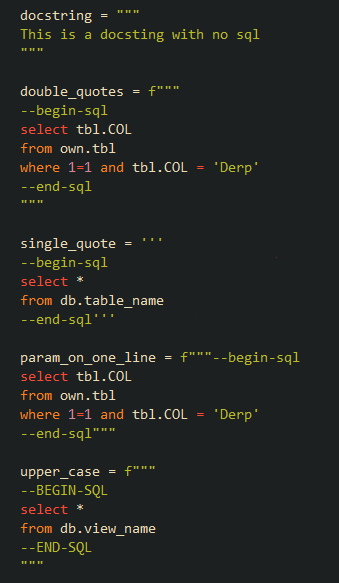

# vim-python-string-sql
This VIM plugin highligh SQL code within Python docstrings.
It aims to replicate the following [VS Code plugin](https://marketplace.visualstudio.com/items?itemName=ptweir.python-string-sql)

# Installation
## With Git
Clone or download this repository on your machine and move the **python.vim** file within the *after/syntax* directory of your vim files.

## With a plugin manager
Add one line to your *vimrc* for your favorite pluging manager to install it for you.
E.g. with Plug:
```vim
Plug 'gilsonk/vim-python-string-sql'
```

# Usage
Within a python docstring (with single or double quotes, f-string or not), enclave your SQL code within the tags **--begin-sql** and **--end-sql**:


